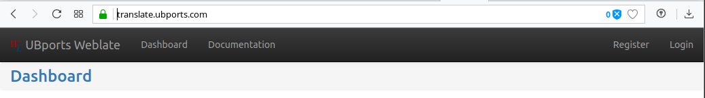
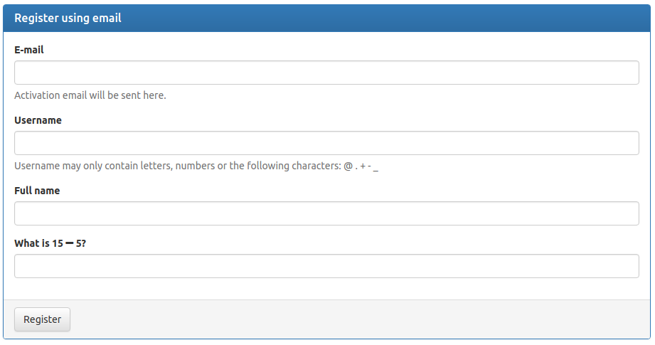
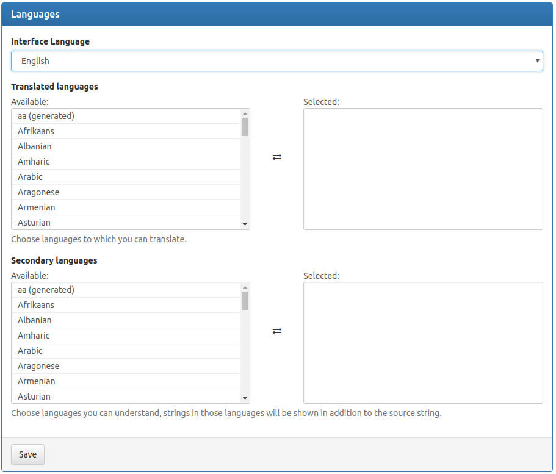
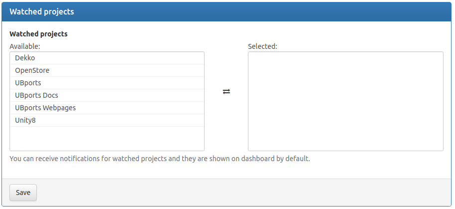
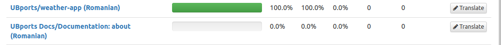
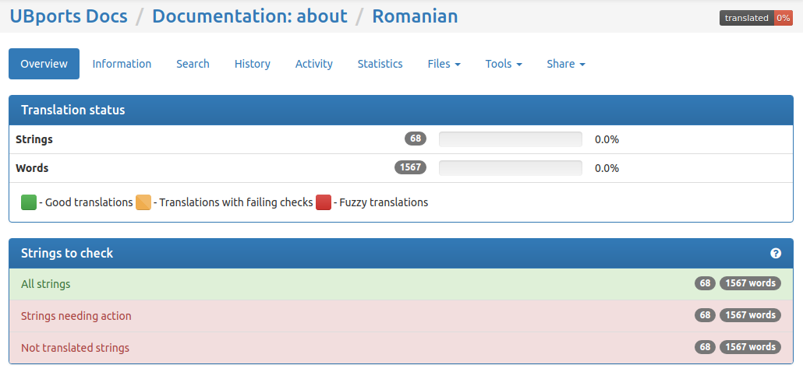

# How to use UBports Weblate

## Step 1 - Registration

To use Weblate you will need to first create an account.

You can do this by going to http://translate.ubports.com. There you should see something like in [Picture 1](#), where you need to click on the *Register* Button in the top right corner. After this you will need to provide the following information: email, username, full name and the answer to a simple anti-bot question (see [Picture 2](#)). Once your registration is completed by clicking the link in a confirmation mail sent to you shortly (please allow on or two hours before complaining about not getting a mail, and check your Spam folder), you will be able to use Weblate.

> 
>
> *Picture 1: Ubports Weblate - index page*

> 
>
> *Picture 2: Registration Form*

## Step 2 - Adding Languages and Projects

The first step in using Weblate is to set one or more languages you speak and add one or more projects that you want to help translate to your dashboard.

### 2.1.  Manage languages

To manage your languages you will need to go to your account settings (by clicking your name in the top right corner) and click *Languages* (if not already selected). Select a language that you want to translate from the *Translated Languages* list and double click it or highlight it and click on the ⇄ button to add that language to the list of languages you can help translate. After you finish adding all languages you want press the Save button at the bottom left side of the page.

> 
>
> *Picture 3: Managing languages*

Note: Secondary languages is for languages that you understand but you are not sure you can help translate, but at least translate from. It is never to late to learn from better, or native speakers.

### 2.2. Managing projects

To manage projects you want to help translate you will need to go to *Watched projects* menu (the only menu with a down arrow that indicates that it has sub-options) and click the grey *Manage watched projects* button from there (it should be the last option in that menu). Add any or all projects you want to help from the right list to the left one using the same technique as the languages case and when you finish press save. In this case, for the main UBports project you will select that one which will include translation of OS, apps, and other important things to the core of Ubuntu Touch.

> 
>
> *Picture 4: Managing projects*

## Step 3 - Translating - Let's do this

### 3.1. Searching for "work"

Go to *Dashboard* and if you set up languages and projects correctly you should see something like a list of apps with the name of the language in between brackets (e.g.: UBports/weather-app (Romanian) ) with a green bar (full, empty or anywhere in between) which indicates the percentage of completion for that app, translated, not translated or not fully translated.  If it's in the last two stages (partially translated or not translated at all)  you are in luck because you have some fun translation work to do! Press on the name of the app or on the button *Translate* that correspond to that app in the list (right side of the list).

> 
>
> *Picture 5: List of apps translated*

### 3.2. Working

From this point on your work is starting because you will need to press on the option *Strings needing action* and start translating the strings.

> 
>
> *Picture 6: Where to find strings to translate*

A Translation Veteran's Piece of advice:
> If you're unsure of a translation, do not press the *Save* button instead go for *Suggest* or *Skip* and come back later. After some time maybe you will get another idea with fresh eyes. — Cristian @ebeton-ro

# Author/Contributors

This document was made by: UBLangs group

- Cristian @ebeton-ro *(original author)*
- Wayne @wayneoutthere
- Peter @peternerlich
